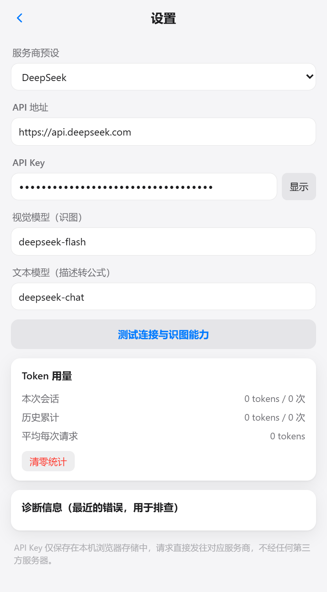

# 公式助手 Formula Copilot

<div align="center">

**在 Microsoft Word 里：截图 / 自然语言 → LaTeX → 一键插入原生公式**

[简体中文](README.md) | [English](README.en.md)


</div>

---

## ⚠️ 安装提示（请先阅读）

> **当前版本的安装过程在不同 Office 版本 / 网络环境下可能遇到兼容性问题**（Office 加载项的侧载机制、微软商店对话框卡死、部分 Office 构建的 OOXML 写入异常等）。本项目已在 Office 家庭版 2024（Windows，16.0.20326）上实测跑通，但手动安装仍可能碰到文档未覆盖的坑。
>
> **⭐ 强烈建议使用 AI 编程代理（ZCode / Claude Code / Cursor 等）来完成安装**：把本仓库地址发给代理，让它克隆、安装依赖、生成证书、装载进 Word 并自动排障——安装脚本与诊断工具都已包含在仓库中（见 [Agent 安装](#-方式一用-ai-agent-安装推荐)）。
>
> 手动安装方式仍然提供，见[下文](#-方式二手动安装)。

---

## 功能

- **识图转公式**：上传图片或直接 `Ctrl+V` 粘贴截图，自动识别为 LaTeX，可编辑后插入
- **自然语言转公式**：用中文描述式子（如"y下标1等于sin x的三次方乘以cos x分之一"），回车生成
- **行内 / 单行**两种插入模式，插入的是 **Word 原生公式对象**（可二次编辑，不是图片）
- **公式实时预览**（基于 Temml / MathML）
- **多模型服务商**：DeepSeek（默认）/ 智谱 GLM / 硅基流动 / 阿里云百炼 Qwen / OpenRouter / 任意 OpenAI 兼容接口
- **一键自检**：测试 API 连通性 + 模型是否真正支持识图
- **Token 用量统计**：单次 / 会话 / 累计
- 双深度兜底插入管线：OOXML 通道失败时自动切换 **HTML+MathML 通道**（Word 原生转换），最终兜底 LaTeX 文本 + `Alt+=` 提示

| 识图 | 设置 |
| --- | --- |
|  |  |

## 工作原理

```
截图 / 描述
    ↓  视觉模型（deepseek-flash 等，thinking 已关闭以保证稳定）
  LaTeX
    ├→ temml → MathML → mathml2omml → OMML ── insertOoxml / setSelectedDataAsync   （OOXML 通道）
    ├→ MathML ──────────────────────────── setSelectedDataAsync(HTML)              （HTML 通道，Word 自动转公式）
    └→ LaTeX 文本 + Alt+= 提示                                                      （最终兜底）
```

多级通道自动降级：哪条通道在你的 Office 构建上可用，就记住并优先使用它。

## 安装

### ⭐ 方式一：用 AI Agent 安装（推荐）

把本仓库的地址交给 AI 编程代理，并告诉它"帮我把这个 Word 加载项装好"。仓库内自带：

- `test/cdp-probe.mjs` 等诊断脚本（可直连任务窗格查看真实报错）
- 本地 HTTPS 服务与自检逻辑
- 完整的已知问题与修复记录（见下方"常见问题"）

Agent 会自动完成：克隆 → `npm install` → 生成并信任 localhost 证书 → 启动本地服务 → 侧载进 Word → 遇到问题时读取诊断输出修复。

### 方式二：手动安装

**前置要求**：Windows 10/11、[Node.js](https://nodejs.org) ≥ 18、Word 2019 / 2021 / 2024（永久版）或 Microsoft 365、网络可访问所选模型服务商。

```bash
git clone https://github.com/aNother1332/word-formula-copilot.git
cd word-formula-copilot
npm install
```

**1. 生成并信任本地证书**（Office 要求 HTTPS）：

```bash
mkdir certs
openssl req -x509 -newkey rsa:2048 -sha256 -days 3650 -nodes \
  -keyout certs/localhost-key.pem -out certs/localhost-cert.pem \
  -subj "//CN=localhost" -addext "subjectAltName=DNS:localhost,IP:127.0.0.1"
certutil -user -addstore Root "%cd%\certs\localhost-cert.pem"
```

**2. 配置 API Key**：

```bash
copy src\user.config.example.js src\user.config.js
# 编辑 src/user.config.js，填入你的 API Key（该文件已被 .gitignore 排除，不会上传）
```
也可以启动后在插件设置页里填写。

**3. 启动本地服务**：

```bash
npm start
```

**4. 装载进 Word**（两种任选）：

- **官方调试工具**（推荐，已在本项目环境实测）：
  ```bash
  npx -y office-addin-debugging start manifest.xml
  ```
  Word 会自动打开并加载插件。
- **Word 内上传**：插入 → 获取加载项 → 我的加载项 → 上传我的加载项 → 选择 `manifest.xml`。
  ⚠️ 该对话框需要联网加载微软商店内容，部分网络环境下会长时间无响应——遇到时请改用上面的命令行方式。

**5. 配置服务商与模型**（设置页右上角齿轮），点"测试连接与识图能力"验证。

## 使用

1. 截图后 `Ctrl+V` 粘贴到窗格（或点击虚线框上传图片），识别自动开始
2. 检查预览与 LaTeX（可直接改），选择 **行内** 或 **单行**
3. 光标放到 Word 里要插入的位置 → 点击 **插入到 Word**

## 配置参考

| 服务商 | 视觉模型（识图） | 文本模型（描述） | API 地址 |
| --- | --- | --- | --- |
| DeepSeek（默认） | `deepseek-flash` | `deepseek-chat` | `https://api.deepseek.com` |
| 智谱 GLM | `glm-4.5v` | `glm-4.6` | `https://open.bigmodel.cn/api/paas/v4` |
| 硅基流动 | `Qwen/Qwen2.5-VL-72B-Instruct` | `deepseek-ai/DeepSeek-V3` | `https://api.siliconflow.cn/v1` |
| 阿里云百炼 | `qwen-vl-max` | `qwen-plus` | `https://dashscope.aliyuncs.com/compatible-mode/v1` |
| OpenRouter | `google/gemini-2.5-flash` | 任意 | `https://openrouter.ai/api/v1` |

> DeepSeek 的 `deepseek-flash` 是推理模型，本项目对其调用已关闭思考模式（`thinking: disabled`）以保证速度与稳定性；其他服务商请在设置中自行调整。

## 常见问题

- **"获取加载项"对话框卡死**：该对话框会在线加载微软商店内容，国内网络常见。改用命令行 `npx office-addin-debugging start manifest.xml` 装载。
- **插入的只是 LaTeX 文本不是公式**：说明你机器的 OOXML 写入通道异常（本项目在某 Office 构建上实测复现过，连普通段落都写入失败）。插件会自动改走 **HTML+MathML 通道**，由 Word 原生转换成公式对象；结果卡片下方的红色诊断框会显示每一层的详细报错。
- **识别慢**：DeepSeek flash 已关闭思考模式（单次约 200~300 tokens）；如仍偏慢可换 Qwen-VL / GLM-4V。
- **想改公式**：插入的是原生公式对象，直接点进去改；或改 LaTeX 后重新插入。
- **卸载本地证书**：`certutil -user -delstore Root localhost`

## 开发与测试

```bash
npm start                 # 启动本地服务（3000 HTTPS / 3100 HTTP）
npm run test              # DeepSeek API 冒烟测试（需 DEEPSEEK_API_KEY 环境变量）
node test/screenshot.mjs  # 重新生成 README 截图
node test/cdp-probe.mjs   # 直连任务窗格 WebView2 检查内部状态（需调试端口）
```

技术栈：原生 HTML/CSS/JS（无框架）· [Office.js](https://learn.microsoft.com/office/dev/add-ins/overview/office-add-ins) · [Temml](https://temml.org)（LaTeX→MathML）· [mathml2omml](https://github.com/fiduswriter/mathml2omml)（MathML→OMML）· Node 本地 HTTPS 服务。

## License

[MIT](LICENSE)
